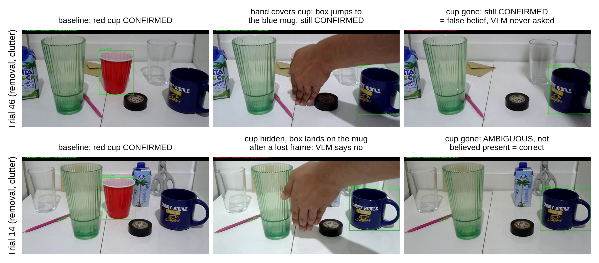
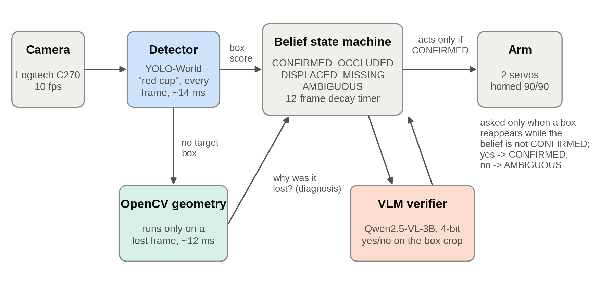

# When Does a Local Vision-Language Model Help?

**Event-gated verification for a robot camera under scene disruptions.** A small vision-language model (VLM) running on a laptop GPU, called on 1.6% of frames, cut false belief on a camera arm, but only when other cups in the scene fooled the object detector.

  

Shaurya S. Khidake · BASIS Phoenix · Polygence research project, 2026

**Paper:** [PDF](paper/paper.pdf) · [Word](paper/paper.docx) · [text](paper/paper.md)



## Abstract

A robot that tracks an object with a camera has to decide what to believe when the object drops out of view. I built a low-cost camera arm that tracks a named object (a red cup). It uses an open-vocabulary detector (YOLO-World) on every frame, OpenCV geometry only when the target is lost, a belief state machine, and a locally run VLM (Qwen2.5-VL-3B in 4-bit) that is consulted only when the detector's evidence looks wrong. In a pre-registered study of 48 staged trials (8 scenarios × 3 repeats × 2 clutter levels, 8,428 frames), I replayed every recorded frame with and without the VLM to isolate what it contributed. The VLM ran on 1.6% of frames. Removing it raised false-belief frames (claiming the cup was present after it was gone) from 196 to 297, but 42 of 48 trials came out identical. All six trials that differed had distractor cups in the scene, and in all six the VLM reduced false belief (sign test, one-sided p = 0.016). The cause was the detector: with clutter it fired on 62.6% of frames in which the cup was absent, compared with 0.6% on a bare rig. The VLM rejected many of these false detections, but only when a lost frame led the pipeline to ask it. It did not hold belief through occlusion. A small local VLM is most useful here as an occasional check on a fast detector, not as a general recovery planner.

## Results

All numbers below come from `results/analysis/analyze.py`. The offline replay is the reference for every with/without-VLM comparison, because both conditions read the same recorded frames.

**With and without the VLM** (replay of all 48 trials)

| | Full system | VLM removed |
|---|---|---|
| False-belief frames | 196 | 297 |
| Lost-while-present frames | 711 | 657 |
| Spurious reacquisitions | 2 | 11 |
| Mean during-disruption accuracy | 0.640 | 0.653 |
| VLM calls | 132 | 0 |

42 of 48 trials were identical. The 6 that differed were all high-clutter, and the VLM lowered false belief in all 6 (one-sided sign test p = 0.016, two-sided 0.031). Two trials account for 62% of the 101 frames saved, so treat this as a direction, not an effect size.

**Why: the detector fires on other cups** (frames where the red cup was truly gone)

| Scene | Detector still reported "red cup" | 95% CI |
|---|---|---|
| Bare rig | 2 / 354 (0.6%) | 0.2% to 2.0% |
| High clutter | 211 / 337 (62.6%) | 57.3% to 67.6% |
| Removal, clutter | 103 / 113 (91.2%) | |
| Substitution, clutter | 83 / 117 (70.9%) | |
| Identity swap, clutter | 25 / 107 (23.4%) | |

Fisher's exact test, bare vs. clutter: p = 2.0 × 10⁻⁸⁴. Median confidence of these false detections was 0.383.

**Verdicts** under the pre-registered rule (pass = accuracy ≥ 0.7 and no false belief; any false belief fails):

| | Pass | Partial | Fail (false belief) | Fail (accuracy < 0.4) |
|---|---|---|---|---|
| Full system | 25 | 0 | 10 | 13 |
| VLM removed | 24 | 0 | 12 | 12 |

**Cost.** Frames without a VLM call took a median 28.8 ms (95th percentile 48.5 ms). Frames with one took 333.6 ms (465 ms). The 10 fps camera, not the computation, set the frame rate.

**What the VLM did not do.** It did not hold belief through occlusion: on the bare rig a covered cup went to MISSING or DISPLACED within about a second, with or without the VLM. It was never asked when the detector's box slid straight from the cup onto a nearby mug (trials 31, 46, 47: 40 false-belief frames each, in both conditions). On identity swaps it lowered false belief (76 to 36 frames) while accuracy also fell (0.301 to 0.183), so it suppressed belief rather than verifying identity.

More in the [paper](paper/paper.pdf), Sections 5 and 6.

## How it works



| Belief state | Meaning | Treated as present? |
|---|---|---|
| CONFIRMED | Target seen and verified | yes |
| OCCLUDED | Not visible, but something is covering its last position | yes, for up to 12 frames |
| DISPLACED | The whole frame changed, probably because the camera moved | no |
| MISSING | The old position now looks like background | no |
| AMBIGUOUS | Something is there, but its identity is in doubt, or the miss is unexplained | no |

The VLM sees the detector's box padded by 25% on each side and gets one question: "Answer yes or no only. Is the main object in this image a red cup?" The pipeline compares the first-token scores for "yes" and "no" and does not generate text. It runs Qwen/Qwen2.5-VL-3B-Instruct through Hugging Face transformers with 4-bit NF4 weights.

## Hardware

| Part | Notes |
|---|---|
| Servo arm (DS3218 servos) | Two joints used in the final run: base pan and shoulder, homed to 90°/90° before every trial |
| Arduino Uno + PCA9685 16-channel PWM board | Firmware in `firmware/servo_controller/`; serial at 115200 baud, commands like `X:+2 Y:-1` |
| UBEC + LiPo battery | Servo power |
| Logitech C270 webcam | Mounted on the arm; 1280×720, recorded at 10 fps |
| Laptop with NVIDIA RTX 3060 Laptop GPU (6 GB) | Runs the detector and the VLM |

**Warning:** servo power and the Arduino must share a ground. See `docs/history/early-2026/system-schematic.md`.

## Reproduce the numbers

You don't need the robot or a GPU for this. You need Python 3 and ffmpeg.

```bash
git clone https://github.com/Alm1973/Adaptability-of-VLMs-in-Robotic-Control-Systems.git
cd Adaptability-of-VLMs-in-Robotic-Control-Systems
pip install -r results/analysis/requirements.txt
python results/analysis/analyze.py --run results/2026-09-01_final --videos media/videos --out results
```

This rewrites `results/summary.json`, the CSV tables in `results/tables/`, and Figures 1 to 7 in `results/figures/`.

## Run the robot

```bash
pip install -r requirements.txt
python avi/preflight.py              # checks code, GPU memory, disk, COM port, camera and detector
python avi/final_experiment.py       # the staged 48-trial experiment (operator prompts each phase)
```

The COM port is set in `avi/arm.py` (`COM5` on the lab laptop). Opening the port resets the Arduino, which moves both servos to center. Read `avi/README.md` before running anything that talks to the arm.

## Repository map

| Folder | Contents |
|---|---|
| `paper/` | The paper (PDF, Word, Markdown source) and `build.js`, which builds the Word file |
| `avi/` | The final system: detector, belief state machine, VLM check, arm and camera control, the experiment script |
| `firmware/` | Arduino sketch for the PCA9685 servo board |
| `results/2026-09-01_final/` | The pre-registered run: per-trial and per-frame results, replay ablation, config, log, and the exact script that ran |
| `results/analysis/` | `analyze.py`, which regenerates every number, table and figure |
| `results/figures/`, `results/tables/` | Generated output |
| `media/` | 48 contact sheets (one per trial) and annotated videos |
| `experiments/` | The pre-registration (`PROTOCOL.md`) and the July to August development experiments |
| `docs/` | Technical write-up, lab notebooks, design notes, integrity checks, project history |
| `archive/` | Code from the April to July phases, kept for the record |

## Limitations

- Small sample: 6 trials per scenario, 3 per scenario and clutter level. The sign test supports a direction, not an effect size.
- One rig, one operator, one target object, one set of clutter objects.
- Clutter is not an independent variable. It works only through the detector's reliability.
- Only 12.1% of scored frames had the cup absent.
- The arm moved only in the camera_pose scenario, so this tested verification with a mostly still camera, not search.
- Software versions were read from the laptop after the run, not logged during it.

## Citation

```bibtex
@misc{khidake2026vlm,
  author       = {Khidake, Shaurya S.},
  title        = {When Does a Local Vision-Language Model Help? Event-Gated Verification for a Robot Camera Under Scene Disruptions},
  year         = {2026},
  howpublished = {Polygence research project},
  url          = {https://github.com/Alm1973/Adaptability-of-VLMs-in-Robotic-Control-Systems}
}
```

## Acknowledgments

Thanks to my Polygence mentor, Erçağ, for guidance throughout this project. Anthropic's Claude helped with planning, code, debugging and editing. I designed and ran every experiment, and every reported result comes from logged trial data.

## License

Code: [MIT](LICENSE). Paper, figures, documentation and data: [CC BY 4.0](https://creativecommons.org/licenses/by/4.0/).
