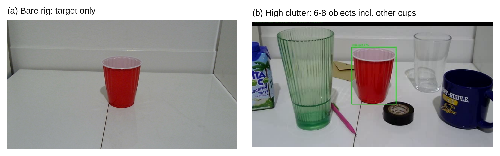
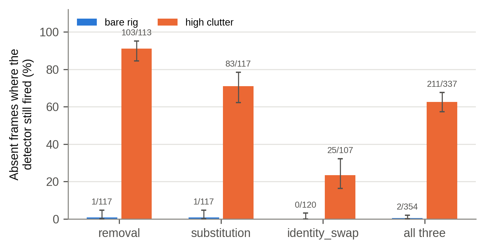
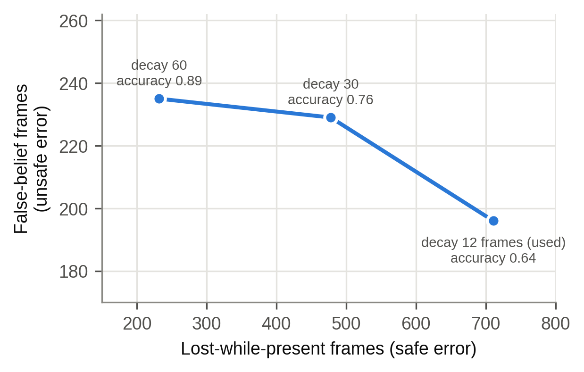
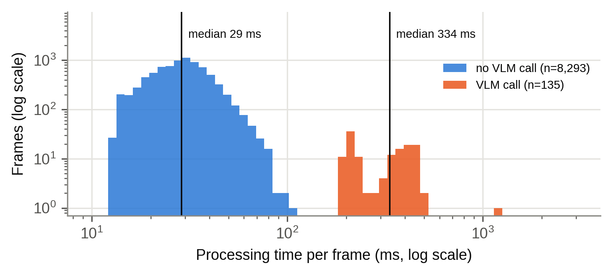

% TITLE: When Does a Local Vision-Language Model Help? Event-Gated Verification for a Robot Camera Under Scene Disruptions
% AUTHOR: Shaurya S. Khidake
% AFFIL: BASIS Phoenix, Phoenix, Arizona, USA
% DATE: Polygence research project, 2026

# Abstract

A robot that tracks an object with a camera has to decide what to believe when the object drops out of view. I built a low-cost camera arm that tracks a named object (a red cup). It uses an open-vocabulary detector (YOLO-World) on every frame, OpenCV geometry only when the target is lost, a belief state machine, and a locally run vision-language model (VLM, Qwen2.5-VL-3B in 4-bit) that is consulted only when the detector's evidence looks wrong. In a pre-registered study of 48 staged trials (8 scenarios × 3 repeats × 2 clutter levels, 8,428 frames), I replayed every recorded frame with and without the VLM to isolate what it contributed. The VLM ran on 1.6% of frames. Removing it raised false-belief frames (claiming the cup was present after it was gone) from 196 to 297, but 42 of 48 trials came out identical. All six trials that differed had distractor cups in the scene, and in all six the VLM reduced false belief (sign test, one-sided p = 0.016). The cause was the detector: with clutter it fired on 62.6% of frames in which the cup was absent, compared with 0.6% on a bare rig. The VLM rejected many of these false detections, but only when a lost frame led the pipeline to ask it. It did not hold belief through occlusion. A small local VLM is most useful here as an occasional check on a fast detector, not as a general recovery planner.

**Keywords:** vision-language models, robot perception, open-vocabulary detection, belief tracking, failure recovery, edge computing

# 1. Introduction

A camera-guided robot loses sight of its target all the time. A hand passes in front of it, the lights change, the robot moves its own camera, or someone takes the object away and leaves something else in its place. After each of these events the robot has to hold some belief about where the object is, and it can be wrong in two ways. It can decide the object is gone when it is only hidden, which wastes a search but is safe because the robot knows it does not know. Or it can keep believing the object is there after it has actually left. I call the second error false belief. For a robot about to grasp something, false belief is the dangerous one, because the arm reaches for empty space or for the wrong object.

Large language and vision-language models have been used to plan robot actions [1]-[4], and they can describe scenes they were never trained on. Most of that work relies on large models running in the cloud, which adds network latency, cost, and a dependence on a connection. Small models can run on a laptop GPU, but they take hundreds of milliseconds per call and are weak at spatial reasoning [7]-[9]. That raises a practical question for low-cost robots: if a small local model is added to a tracking system, what does it actually do?

This project started in April 2026 with a broad question about whether a locally run model could help a robot recover from occlusion, environment changes, and unexpected objects. By September the question had narrowed to this:

> Can a locally hosted vision-language model, embedded in a reasoning pipeline that uses OpenCV for spatial reasoning, recover from disruptions to object verification caused by occlusion, environment change, and unexpected objects, and which component of the pipeline actually does the recovering?

The last clause matters most. A complete system that works tells us little about the model inside it. To attribute an effect to the VLM, the study compares the full pipeline against the same pipeline with only the VLM removed, on the same recorded frames.

This paper makes five contributions:

1. A working hybrid tracking pipeline on a low-cost two-servo camera arm, in which a fast detector runs on every frame and the VLM is called only on events (1.6% of frames in the final study).
2. A pre-registered study of 48 staged trials with a frame-replay ablation that isolates the VLM, using false belief as the primary measure.
3. The finding that the VLM's measurable benefit came from rejecting the detector's false detections when other cups were nearby, together with a limit: the VLM helped only when the pipeline asked it, and the pipeline did not ask when the detector's mistake looked like normal tracking.
4. Evidence from earlier pilot studies that synthetic disruptions can point to the wrong design choice.
5. Open code, data, and a script that regenerates every number and figure in this paper.

# 2. Related work

## 2.1 Language and vision models as robot planners

SayCan [1] combines a large language model's judgment of which skill fits an instruction with learned estimates of whether each skill can succeed in the current scene. Code as Policies [2] prompts a language model to write robot control code that calls perception and motion functions. RT-2 [3] fine-tunes a large vision-language model on web data and robot demonstrations so that it outputs actions directly. Yoshida et al. [4] used GPT-4 to turn text descriptions into motion code for the humanoid robot Alter3. These systems show that language models can direct robots, but they use very large models, usually in the cloud. My project uses a 3-billion-parameter model on a laptop and asks a narrower question: when does such a model add anything to a conventional vision pipeline?

## 2.2 Vision-language-action models

OpenVLA [5] and π0 [6] are trained end to end on large robot datasets and map images and instructions straight to motor commands. I looked at this approach in July 2026 and set it aside. These models target manipulators with six or more joints and joint feedback, while my arm has two servos and no encoders, and an end-to-end policy would remove the explicit reasoning step that this project set out to study.

## 2.3 Limits of vision-language models

OmniSpatial [7] and LRR-Bench [8] report that VLMs handle basic left/right relations but struggle with harder spatial tasks such as rotation and movement. Yuksekgonul et al. [9] found that contrastively trained VLMs often behave like bags of words and bind attributes to the wrong objects. My own early tests agreed with this. In May, LLaVA took 67.8 s per call and chose the same command whether a target was centered or off to one side. Later, when Qwen2.5-VL was asked which way to search, it answered "left" on 80 of 80 real frames. For these reasons the final system keeps all geometry in OpenCV and asks the VLM only yes/no questions about identity.

## 2.4 Open-vocabulary detection

YOLO-World [10] detects objects named in a text prompt in real time, so a user can ask for "red cup" without training a new model. The pilot work for this project found that it matches the noun more than the qualifier: a prompt for "blue cup" fired at confidence 0.712 on the same box as "red cup" in a scene with no blue cup. That is one reason a separate identity check might be useful.

## 2.5 Running models locally

The VLM used here is Qwen2.5-VL-3B-Instruct [11], loaded through the Hugging Face Transformers library [13] with 4-bit NF4 quantization, a format introduced with QLoRA [12]. The detector runs through the Ultralytics YOLO library [16], and image geometry uses OpenCV [14].

# 3. System design

## 3.1 Hardware

The arm has two servos driven through an Arduino Uno and a PCA9685 PWM board: a base servo that pans the camera and a shoulder servo that swings the whole arm. A hardware check on 1 September 2026 confirmed that the second channel drives the shoulder, so the "tilt" axis moves the camera's position rather than just rotating it. A Logitech C270 webcam on the arm captures 1280×720 images, and the run recorded frames at a fixed 10 frames per second. All computation runs on a laptop with an NVIDIA RTX 3060 Laptop GPU (6 GB). Before every trial the arm returns to a home position of 90° on both servos.

## 3.2 Pipeline

Figure 1 shows the pipeline. Each frame goes to the detector first. What happens next depends on whether the detector finds the target and on what the system currently believes.

**Detector.** YOLO-World (the yolov8s-worldv2 weights) is set to the class "red cup" and runs on every frame in about 14 ms. The pipeline keeps the highest-scoring "red cup" box above a score of 0.10 and records other objects scoring at least 0.25, which it uses to reason about what might be covering the target.

**Belief states.** The belief state machine holds one of five states (Table 1). The system treats the target as present when the state is CONFIRMED or OCCLUDED.

Table 1. Belief states and the action each one triggers.

| State | Meaning | Action |
|---|---|---|
| CONFIRMED | Target seen and verified | Track it |
| OCCLUDED | Not visible, but something is covering its last position | Hold still and wait |
| DISPLACED | The whole frame changed, probably because the camera moved | Re-localize |
| MISSING | The old position now looks like background | Search |
| AMBIGUOUS | Something is there, but its identity is in doubt, or the miss is unexplained | Re-check in place |

**OpenCV diagnosis.** When the detector misses the target, OpenCV compares the current frame with the last clean frame in which the target was confirmed. It measures the overall change, the change inside the target's box, how well edges still line up, and how much the background around the box moved. It also checks whether another detected object overlaps the target's last box and whether the target region now looks like the surrounding background. These measurements choose between OCCLUDED, DISPLACED, MISSING, and AMBIGUOUS, at a cost of about 12 ms. When the pipeline itself commands the arm to move, it flags the next frame so that its own motion is not mistaken for a disruption.

**Decay timer.** OCCLUDED cannot last forever. If the target has not been seen for 12 frames (1.2 s at 10 fps), OCCLUDED becomes MISSING.

**VLM verifier.** The VLM is Qwen2.5-VL-3B-Instruct, quantized to 4 bits and capped at a small image size (100,352 pixels in the archived code). It receives the detector's box, padded by 25% on each side, with the prompt "Answer yes or no only. Is the main object in this image a red cup?" Instead of generating text, it compares the model's scores for the tokens "yes" and "no" after a single forward pass, which is faster and always gives a usable answer. The pipeline calls the VLM when a target box appears while the belief is anything other than CONFIRMED. A "yes" moves the belief to CONFIRMED. A "no" sets it to AMBIGUOUS, and after a rejection the VLM is asked again only every eighth frame. While the belief is CONFIRMED, new detector boxes are accepted without a VLM check. This event-based rule keeps the VLM cheap, and Section 5 shows that it also creates a blind spot.

**Arm control.** The arm moves only when the belief is CONFIRMED. In OCCLUDED it deliberately stays still instead of scanning away from an object that has not moved.

## 3.3 How the system got here

The final design came from a series of failures, summarized in Table 2. The latency numbers in this table come from informal benchmarks and are preliminary.

Table 2. Development history.

| When | Change | What was learned |
|---|---|---|
| April | Plan: Raspberry Pi 5, Pixy2 color camera, text-only language model | A text-only model cannot see the scene |
| May | Camera frames sent to LLaVA on a laptop | 67.8 s per call; could not tell which way to move |
| June | Four-servo arm, color-threshold tracking of the red cup | Tracking worked; recovery did not exist yet |
| July | Qwen2.5-VL-3B through Ollama; a recovery state that asked the VLM where to look | A context-size setting cut steady-state latency from about 3.2 s to 1.4 s |
| Early August | GPU runs began returning garbage ("@@@@") | Moving the model to the Transformers library removed it; capping image size cut a call from 5.62 s to 0.58 s |
| Mid August | YOLO-World detector, belief state machine, synthetic and live ablations | Synthetic tests misled the design (Section 5.10) |
| 1 September | Pre-registered 48-trial study on a controlled rig | This paper |

# 4. Experiment

## 4.1 Rig and scenarios

The study ran on a controlled rig: a fixed white work surface, a lamp, and a marked position for the red cup (Figure 2). Every trial used one of eight scenarios (Table 3), each at two clutter levels. With no clutter, the red cup stood alone. With high clutter, six to eight other objects stood around it, including at least two other cups or mugs of different colors, without covering it. The same objects were used all session.

Table 3. The eight scenarios. "Ends" gives whether the red cup is present at the end of the trial.

| Scenario | Category | Disrupt phase | Recover phase | Ends |
|---|---|---|---|---|
| control | control | nothing changes | nothing changes | present |
| lighting | environment | lamp off or dimmed | lighting restored | present |
| camera_pose | environment | arm pans itself 12° | arm pans back | present |
| occlude_hand | occlusion | hand fully covers the cup | hand removed | present |
| occlude_object | occlusion | cardboard box hides the cup | box removed | present |
| removal | occlusion | hand covers the cup | cup taken away under the hand | absent |
| substitution | unexpected object | hand covers the cup | cup swapped for pink pliers | absent |
| identity_swap | identity | hand covers the cup | cup swapped for a different-colored cup | absent |

## 4.2 Protocol

Each trial had three phases of 6 s each: baseline, disrupt, and recover. The script printed an instruction before each phase and waited for me to confirm that the scene was set, then recorded every frame. Ground truth (target present or absent) came from the instruction the script gave at capture time, not from watching the footage afterward. Frames within 1 s of a phase change were still processed, so the belief stayed continuous, but they were not scored, because while a hand is halfway over the cup the truth is unclear. That leaves 4 of every 6 seconds scored. Trial order was counterbalanced by block with a fixed random seed (20260901). The arm returned home before every trial. Two trials (3 and 6) were restaged before scoring because I made mistakes setting them up; both restagings are in the run log, and the discarded attempts were not scored.

## 4.3 Measures and pre-registration

Before the run, the measures and pass rules were written into the experiment's configuration file and scoring code:

- **False belief** (primary): frames where the system believes the cup is present and it is not. It is never averaged into accuracy.
- **During-disruption accuracy**: the share of scored frames in the disrupt phase where the belief matched the truth.
- **Lost while present**: frames where the cup was there but the system did not believe it.
- **Spurious reacquisition**: whether a trial ended CONFIRMED although the cup was gone.

A trial passes if accuracy is at least 0.7 with zero false belief, is partial if accuracy is at least 0.4 with zero false belief, and fails otherwise. Any false belief at all fails the trial.

## 4.4 Replay ablation

To isolate the VLM, every recorded frame was replayed offline through two versions of the pipeline: the full system (D_full) and the same system with the VLM removed (E_no_vlm). Both versions saw byte-identical frames, so differences in how I staged a trial cannot explain a difference between them. The same replay also re-ran the full system with the decay timer set to 30 and 60 frames. The replay scores are the authoritative numbers in this paper. They differ slightly from the scores logged live during the run (193 versus 196 false-belief frames for the full system), because image compression shifts the detector's confidence on borderline frames.

## 4.5 A scoring correction

After the run I found that the live scorer had computed accuracy over the disrupt and recover phases together, while the pre-registered definition, and the replay scorer, use the disrupt phase only. The recover phase is easy because the disruption is over, so the live numbers were too generous. False belief was computed the same way in both scorers and was not affected. All accuracy numbers and pass/fail verdicts in this paper use the disrupt-phase definition. For reference, the live scorer reported 25 pass, 13 partial, and 10 fail; under the pre-registered definition the 13 partials become failures (Table 4).

## 4.6 Statistics

Proportions are reported with Wilson 95% confidence intervals [15]. Detector error rates with and without clutter are compared with Fisher's exact test. For the VLM's effect, I used a sign test on the trials in which the two conditions differed, since a few trials with large differences would dominate any average. The pre-registered hypothesis predicted the direction (that the VLM reduces false belief), so the one-sided p-value is the planned test; the two-sided value is also given. With 3 trials per scenario and clutter level, tables broken down that finely are descriptive only.

# 5. Results

## 5.1 The corpus

The run produced 8,428 frames over 44.7 minutes of trials. Of these, 5,699 were scored and 2,729 were edge frames. The cup was absent in 691 scored frames (12.1%). The median time between frames was 0.100 s, so the camera ran at 10 fps. Some earlier project notes gave 28 fps; that figure was the pipeline's processing speed, not the capture rate, so frame counts in this paper convert to time at 10 frames per second.

## 5.2 Verdicts

Table 4 gives the verdicts under the pre-registered rule. With the VLM, 25 trials passed. Every control, lighting, and camera_pose trial passed in both conditions: 18 of 18. Commanded camera motion never registered as a disruption, and lighting changes never broke detection. This part of the problem was solved by ordinary engineering, and the VLM added nothing to it.

Table 4. Verdicts under the pre-registered rule (disrupt-phase accuracy, replay scores). n = 48 trials per condition.

| Condition | Pass | Partial | Fail: false belief | Fail: accuracy < 0.4, no false belief |
|---|---|---|---|---|
| Full system (D_full) | 25 | 0 | 10 | 13 |
| VLM removed (E_no_vlm) | 24 | 0 | 12 | 12 |

The 23 failures with the VLM split into two kinds. Ten involved false belief. The other 13 involved no false belief at all: the system lost the cup while it was hidden and said so. Those trials are safe but blind. In all of them the cup was fully hidden during the disrupt phase, and 11 of the 13 were on the bare rig (Section 5.6).

## 5.3 What the VLM changed

Table 5 compares the two conditions over all 48 trials. With the VLM, false-belief frames fell from 297 to 196, and trials ending in a false "found it" fell from 11 to 2. Lost-while-present frames rose slightly (657 to 711), and mean accuracy barely moved.

Table 5. Replay ablation totals over 48 trials.

| Condition | False-belief frames | Lost-while-present frames | Spurious reacquisitions | Mean accuracy | VLM calls |
|---|---|---|---|---|---|
| Full system (D_full) | 196 | 711 | 2 | 0.640 | 132 |
| VLM removed (E_no_vlm) | 297 | 657 | 11 | 0.653 | 0 |

The total hides how the difference was spread (Figure 3). In 42 of the 48 trials, false belief was identical with and without the VLM. Six trials differed, and in all six the VLM lowered false belief (one-sided sign test p = 0.016; two-sided p = 0.031). The VLM never increased false belief. Two trials, 14 and 9, account for 63 of the 101 frames saved (62%). The 101-frame difference therefore describes six episodes, mostly two, and should not be quoted as a percentage reduction. What the data supports is the direction: the VLM reduced false belief and never made it worse.

## 5.4 Clutter and the detector's false detections

All six trials that differed had clutter. Splitting by clutter makes the pattern plain: on the bare rig, false belief was 19 frames in both conditions, while with clutter it was 177 with the VLM and 278 without it.

The reason is the detector. On scored frames where the red cup was absent, the detector still reported a "red cup" on 2 of 354 frames without clutter (0.6%, 95% CI 0.2% to 2.0%) and on 211 of 337 frames with clutter (62.6%, 95% CI 57.3% to 67.6%; Fisher's exact p < 10^{-80}). With clutter the rate was 91.2% for removal, 70.9% for substitution, and 23.4% for identity_swap (Figure 4). These false detections had a median confidence of 0.383 (range 0.174 to 0.820). The detector was calling other cups, and in several trials the blue mug, a red cup, and it was not marginal about it.

So the chain in the six differing trials was: another cup is in view, the detector labels it "red cup," the pipeline asks the VLM about that box, and the VLM says no. On the bare rig the detector rarely made that mistake, so there was nothing for the VLM to catch. That is why 42 trials came out identical.

## 5.5 When the VLM was never asked

The VLM caught the detector's mistakes only when it was asked, and it was asked only when a target box appeared while the belief was not CONFIRMED. Figure 5 shows two removal trials with clutter. In trial 14 the belief dropped out of CONFIRMED while the hand covered the cup. When the detector then boxed the blue mug, the VLM was asked, rejected it, and the belief stayed AMBIGUOUS, so no false belief was recorded. In trial 46, the detector's box moved from the red cup to the blue mug without a single missed frame. The belief never left CONFIRMED, the VLM was never asked, and the system reported the cup present for all 40 scored frames after it was gone.

Three trials failed this way: 31 and 47 (substitution) and 46 (removal). Each recorded 40 false-belief frames with the VLM and 40 without it, and the full system called the VLM only once or twice in the whole trial. Across scenarios, the VLM was called 6.5 times per identity trial, 3.5 per occlusion-category trial, and 2.0 per substitution trial. The rule that keeps the VLM cheap is the same rule that keeps it from seeing errors the detector does not flag.

## 5.6 Occlusion

Occlusion, the first failure named in the research question, produced no false belief in any of the 12 occlusion trials, with or without the VLM. But looking at the belief frame by frame (Table 6) shows that this was not because the system held its belief through the occlusion.

On the bare rig, a full hand occlusion sent the belief to MISSING within about a second (38 of 40 scored frames), and a box occlusion sent it to DISPLACED for all 40 frames. The box changed so much of the image that the diagnosis read it as camera motion. Accuracy during the disruption was 0.0 to 0.05. The system was safe, since it never claimed a missing cup, but it was blind, and it reacquired the cup once the occluder was removed. The 12-frame timer holds belief for only 1.2 s, and these occlusions lasted most of the 6 s disrupt phase. Trial 21 was the exception: the detector kept firing throughout, possibly because the box did not fully hide the cup.

With clutter, four of the six occlusion trials scored near 1.0. In each of them the detector kept firing on at least 95% of the frames in which the cup was covered. In the recorded frames of trials 32 and 48, its box sat on the blue mug. The belief stayed CONFIRMED and happened to match the truth, because the red cup really was still behind the hand. Only trial 10 held its belief the intended way, through the OCCLUDED state, with the detector silent.

Table 6. Disrupt-phase behavior in the 12 occlusion trials (live run). "Detector fired" is the share of disrupt frames with a red-cup box while the cup was covered.

| Scenario | Clutter | Trials | Belief correct | Detector fired | Main state |
|---|---|---|---|---|---|
| occlude_hand | none | 3, 17, 33 | 0.05 each | 0% | MISSING |
| occlude_object | none | 4, 35 | 0.00 each | 0% | DISPLACED |
| occlude_object | none | 21 | 1.00 | 100% | CONFIRMED |
| occlude_hand | high | 10 | 0.79 | 0% | OCCLUDED |
| occlude_hand | high | 32, 48 | 1.00 each | 100% | CONFIRMED (box on blue mug) |
| occlude_object | high | 16, 27, 44 | 0.97 to 1.00 | 95% to 100% | CONFIRMED |

## 5.7 Identity swaps

The identity_swap scenario replaces the red cup with a cup of another color, which the detector cannot reliably tell apart. With the VLM, false belief in these trials fell from 76 frames to 36. But accuracy during the disruption also fell, from 0.301 to 0.183, because with the VLM the system less often believed the real cup was there while the hand covered it. The VLM made the system more cautious in general. It did not reliably confirm which cup was which, and the two numbers have to be reported together.

## 5.8 The decay timer

Raising the decay timer trades one error for the other (Figure 6). Going from 12 to 60 frames cut lost-while-present frames from 711 to 232 and raised accuracy from 0.640 to 0.890, but false belief rose from 196 to 235. The cost fell unevenly. In the occlusion category, false belief rose by only one frame (60 to 61, all of it in removal trials) while accuracy rose from 0.516 to 0.831, because during the disrupt phase the cup really was behind something. In the unexpected-object category, false belief rose from 100 to 134, because the cup really was gone. On the bare rig, the timer also caused most of the small false-belief counts in removal and substitution. In trial 39, for example, 12 of the 14 false-belief frames came from the belief staying OCCLUDED for 12 frames after the pliers replaced the cup, since an object left where the cup had been looks at first like something covering it.

## 5.9 Speed

The VLM ran on 135 of 8,428 frames (1.6%) in the live run. Frames without a VLM call took a median of 28.8 ms to process (95th percentile 48.5 ms); frames with one took a median of 333.6 ms (95th percentile 465 ms). Figure 7 shows the two groups. Over all frames the pipeline averaged 34.6 ms, fast enough for about 29 frames per second, so the 10 fps camera, not the computation, limited the frame rate.

## 5.10 Pilot studies (exploratory)

Before the controlled rig, I ran exploratory studies in August on a desk. They were not pre-registered and used very small samples, but two results shaped the final design.

First, a synthetic corpus pointed the wrong way. I built 36 synthetic episodes by editing real photos: pasting rectangles over the cup, painting it out, or changing its color. On this corpus the full system with the 12-frame timer scored 0.968 on occlusion, better than a variant that asked the VLM what was covering the target (0.786). On 7 real occlusion episodes, the order reversed (0.299 versus 0.504). The synthetic disruptions lasted 4 to 14 frames, never long enough to outlast the 12-frame timer, while real occlusions lasted 40 to 61 frames. Because the simulated disruptions were easier than real ones, they favored the wrong design.

Second, the VLM-based features that looked promising turned out to be simpler mechanisms in disguise. The "what is covering it?" variant won on real hand occlusions only because the VLM said "hands" and the word "hand" was on a fixed list. Removing five hand-related words from the list dropped its score from 0.504 to 0.141. On other occluders the VLM said "notebook" for a cardboard box, "socks" for a jacket sleeve, and "document" for a sheet of paper. In a simulated search task, the VLM chose search directions worse than random: it found the target 3 times in 7, while random choices found it 27 times in 35.

# 6. Discussion

## 6.1 Answering the research question

The pipeline handled environment changes completely, and it did so through ordinary engineering: a detector that is robust to lighting, and a flag that tells the tracker when the robot moved its own camera. It did not recover from full occlusion in the sense of holding its belief; on the bare rig it went safely blind and reacquired the cup afterward. The one thing the local VLM measurably did was reduce false belief when other cups fooled the detector. In the six trials where it made any difference, it helped every time.

## 6.2 The April hypothesis

In April I predicted that occlusion would be easiest, environment changes harder, and unexpected or anomalous objects hardest, and I expected the difficulty to come from the language model's limits. The ordering was partly right: the trials that ended with the cup gone (removal, substitution, and identity swap) produced every false belief in the study. But the reason was different. The failures came from the detector confidently labeling other objects as the target, and environment changes were the easiest category, not the middle one.

## 6.3 When the VLM is worth its cost

A VLM call cost about 333 ms against about 29 ms for a normal frame. The results suggest spending that time only where the fast detector is likely to be wrong: in clutter, where similar objects are near the target. On the bare rig the VLM added no measurable value. Two cheaper options remain untested. First, 96% of the detector's false detections scored below 0.5, so a stricter detection threshold might remove many of them at no cost, though it could also drop real detections of a partly hidden cup. Second, the blind spot in Section 5.5 could be closed by re-checking a CONFIRMED target now and then, or whenever its box jumps in position or size. That would have given the VLM a chance in trials 31, 46, and 47, at the price of more calls.

## 6.4 Why false belief is kept separate

False belief and accuracy can point in opposite directions. In the identity trials the VLM lowered false belief and also lowered accuracy, and in a pilot episode removing the VLM raised accuracy from 0.615 to 0.923 while increasing false belief from 5 frames to 23. Ranking the two versions by accuracy alone would have picked the more dangerous one. For a robot that will act on its belief, the two errors are not equal, and averaging them hides the one that matters.

## 6.5 Lessons about method

Several results in this project looked clean and were wrong at first. Across the project I documented 13 measurement bugs. The accuracy-window error described in Section 4.5 was the last one, and it was found only after the run. Two others share a pattern. A capability credited to the VLM turned out to be a simpler mechanism doing the work: a word list in the occluder check, and a search function that returned nothing on every frame, which looked the same as finding nothing. Both survived because their failures were silent. Comparing two independent measurements of the same thing caught most of these problems.

# 7. Limitations

- The sample is small. There were 6 trials per scenario and 3 per scenario and clutter level, so the per-scenario tables describe what happened and do not support rankings. The sign test supports a direction, not an effect size.
- Everything ran on one rig, with one operator, one target object, and one set of clutter objects. A cardboard box was the only rigid occluder in the final study.
- Clutter is not a clean independent variable, because its effect works entirely through the detector's reliability.
- How long the detector kept firing after the cup left varied a lot between repetitions of the same scenario (for removal with clutter, from 72% to 100% of absent frames). That depended on staging and was not controlled.
- Only 12.1% of scored frames had the cup absent. The project had set 15% as a minimum for measuring false belief well, and a planned absence-heavy session has not been run.
- The final study tested verification with a mostly still camera. The arm moved only in the camera_pose scenario. Search was tested only in the exploratory pilot.
- Software versions were recorded about four weeks after the run, not at run time.

# 8. Future work

The most useful next step is a short follow-up of about 24 trials that covers only the scenarios where the cup ends up gone (removal, substitution, and identity swap, 8 repeats each), which would turn the directional result into an effect size. That run should also log the detector's box on every frame, re-run the ablation with a stricter detection threshold, and test periodic re-checks while CONFIRMED and a timer that waits longer in OCCLUDED than after signs of a swap. For occluders, a text-classifier replacement for the word list scored 23 of 25 on the VLM's own descriptions in an offline test, but it has not yet been re-run on live occlusion scenarios. Moving the pipeline to a Raspberry Pi remains the original long-term goal.

# 9. Conclusion

I built a camera-arm tracker that uses a fast open-vocabulary detector, OpenCV geometry, and a belief state machine, and calls a small local VLM on about one frame in sixty. In a pre-registered 48-trial study with a replay ablation, the VLM did not keep belief alive through occlusion, and it added nothing on an uncluttered rig. Its measurable contribution was narrower: when other cups were in view and the detector mistook them for the target, the VLM rejected those detections, reducing false belief in every trial where it made a difference. It could only do that when the pipeline asked it. For a small robot, that points to a local VLM used as an occasional check on a fast detector, triggered where the detector is likely to be fooled.

# Acknowledgments

I thank my Polygence mentor, Erçağ, for guidance throughout this project.

# Code and data availability

Code, the configuration and results of the 1 September 2026 run (results.csv, results.json, ablation_scores.json, run_log.txt), curated contact sheets and videos, and the analysis script that regenerates every number and figure in this paper are at https://github.com/Alm1973/Adaptability-of-VLMs-in-Robotic-Control-Systems. The full set of raw frames (3.1 GB) is available from the author and will be archived with the tagged release.

# AI-use statement

Anthropic's Claude was used for planning, code assistance, debugging support, and editing. All experiments were designed and run by the author, and all reported results come from logged trial data. The author reviewed and takes responsibility for all content.

# References

[1] M. Ahn et al., "Do As I Can, Not As I Say: Grounding Language in Robotic Affordances," arXiv:2204.01691, 2022.

[2] J. Liang, W. Huang, F. Xia, P. Xu, K. Hausman, B. Ichter, P. Florence, and A. Zeng, "Code as Policies: Language Model Programs for Embodied Control," in Proc. IEEE Int. Conf. Robotics and Automation (ICRA), 2023. arXiv:2209.07753.

[3] A. Brohan et al., "RT-2: Vision-Language-Action Models Transfer Web Knowledge to Robotic Control," arXiv:2307.15818, 2023.

[4] T. Yoshida, A. Masumori, and T. Ikegami, "From text to motion: grounding GPT-4 in a humanoid robot 'Alter3'," Frontiers in Robotics and AI, vol. 12, Art. no. 1581110, 2025, doi: 10.3389/frobt.2025.1581110.

[5] M. J. Kim et al., "OpenVLA: An Open-Source Vision-Language-Action Model," arXiv:2406.09246, 2024.

[6] K. Black et al., "π0: A Vision-Language-Action Flow Model for General Robot Control," arXiv:2410.24164, 2024.

[7] M. Jia et al., "OmniSpatial: Towards Comprehensive Spatial Reasoning Benchmark for Vision Language Models," arXiv:2506.03135, 2025.

[8] F. Kong, J. Duan, K. Xu, Z. Guo, X. Zhu, and X. Shi, "LRR-Bench: Left, Right or Rotate? Vision-Language Models Still Struggle With Spatial Understanding Tasks," arXiv:2507.20174, 2025.

[9] M. Yuksekgonul, F. Bianchi, P. Kalluri, D. Jurafsky, and J. Zou, "When and why vision-language models behave like bags-of-words, and what to do about it?" in Proc. Int. Conf. Learning Representations (ICLR), 2023. arXiv:2210.01936.

[10] T. Cheng, L. Song, Y. Ge, W. Liu, X. Wang, and Y. Shan, "YOLO-World: Real-Time Open-Vocabulary Object Detection," in Proc. IEEE/CVF Conf. Computer Vision and Pattern Recognition (CVPR), 2024. arXiv:2401.17270.

[11] S. Bai et al., "Qwen2.5-VL Technical Report," arXiv:2502.13923, 2025.

[12] T. Dettmers, A. Pagnoni, A. Holtzman, and L. Zettlemoyer, "QLoRA: Efficient Finetuning of Quantized LLMs," arXiv:2305.14314, 2023.

[13] T. Wolf et al., "Transformers: State-of-the-Art Natural Language Processing," in Proc. Conf. Empirical Methods in Natural Language Processing: System Demonstrations, 2020.

[14] G. Bradski, "The OpenCV Library," Dr. Dobb's Journal of Software Tools, 2000.

[15] E. B. Wilson, "Probable inference, the law of succession, and statistical inference," J. American Statistical Association, vol. 22, no. 158, pp. 209-212, 1927.

[16] G. Jocher, J. Qiu, and A. Chaurasia, "Ultralytics YOLO," 2023. [Online]. Available: https://github.com/ultralytics/ultralytics

# Appendix A. VLM prompt and settings

- Verification prompt: "Answer yes or no only. Is the main object in this image a red cup?"
- Input: the detector's box padded by 25% on each side.
- Decision: compare the first-token scores for "yes" and "no" after one forward pass (no text generation).
- Model: Qwen/Qwen2.5-VL-3B-Instruct, 4-bit NF4 weights with 16-bit compute, image capped at 100,352 pixels in the archived code.
- Call rule: only when a target box appears while the belief is not CONFIRMED; after a rejection, re-asked every eighth frame.
- Detector: YOLO-World yolov8s-worldv2, class "red cup", minimum target score 0.10 inside the pipeline.
- Decay timer: 12 frames. Surround-similarity threshold for "removed": 0.67.

# Appendix B. Reproducing the numbers

Every number, table, and figure in Sections 4 and 5 comes from one script, results/analysis/analyze.py in the repository, run on the raw files of run 2026-09-01_233533 (stored in results/2026-09-01_final). From the repository root:

python results/analysis/analyze.py --run results/2026-09-01_final --videos media/videos --out results

It writes summary.json, the CSV tables (verdicts, ablation totals, differing trials, detector false detections with confidence intervals, occlusion states, the detection-after-removal breakdown, and results by category), and Figures 1 to 7. The pilot results in Section 5.10 come from the August lab notebook and write-up, not from this script.
